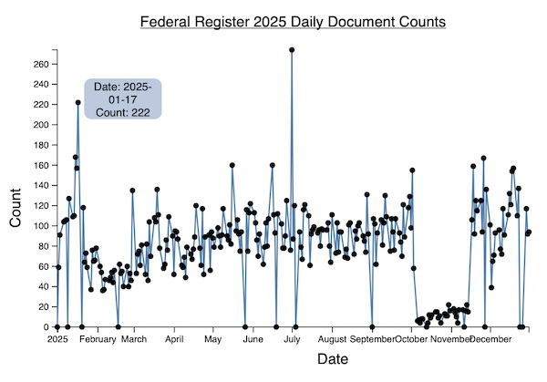

## Line Plot : Date vs Counts - V2

A basic line plot with dates on y-axis and counts on x-axis.

Dataset is described and analyzed for anomalies [here](https://nmoroney.github.io/data/2026/260103_fr_2025/index.html).

Includes tooltip.



Prompt :

```
For the data.tsv file create a d3.js Javacsript function to generate a line plot of the input data 2025-FR-doc_counts.tsv.
The function should have input parameters of the name of the input data file and the title of the plot.
The first line of the input TSV file contains the names to use for the x and y axes.
The line plot should plot the date versus the count.
It should also include a tooltip to provide label of individual date versus counts data points.
The output plot should have axes labels and a title.
```

