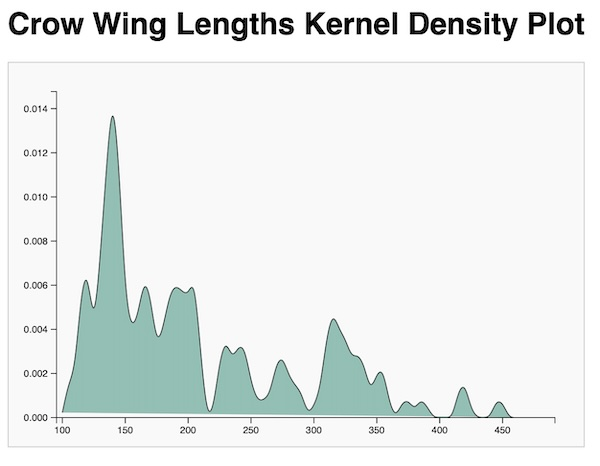

## Gem D3 : Density Plot

Gnerate a d3.js density plot for the crow wing length data.



Note the fill color ```#69b3a2``` is identical to [this example](https://d3-graph-gallery.com/graph/density_basic.html) of a d3.js density plot.

---

The prompt:

```
Write a Javascript function to generate a d3.js kernel density plot for the input data file crow_wing_lengths.txt.
The function should take input parameters of input data file name, plot width and plot height.
Generate the JavaScript code and save to file.
Also generate an index.html file to call this javascript function.
Do not start any processes to install or invoke an http server.
```
