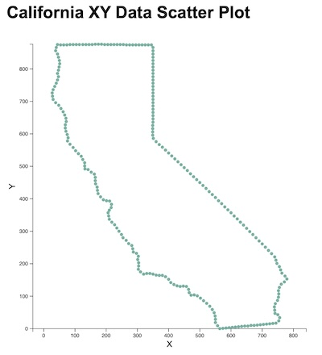

## Gem D3 : 2D Scatter Plot

Generate 2D or XY scatter plot for input data, a point sampling of the California border.



The prompt:

```
Write a Javascript function to generate a d3.js fixed aspect ratio scatter plot for the input 2D data in the file california_xy.tsv.
The function should take input parameters of input data file name, plot width and plot height.
Generate the JavaScript code and save to file. 
Also generate an index.html file to call this javascript function. 
Do not start any processes to install or invoke an http server.
```
