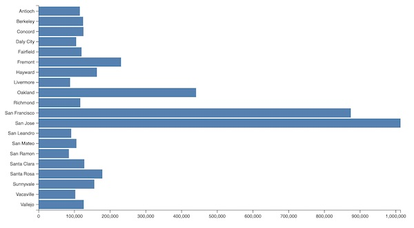

## Gem D3 : Horizontal Bar Chart

Generate a d3.js horizontal bar chart for top 20 Bay Area cities by (2020) population.



The prompt :

```
Write a Javascript function to generate a d3.js horizontal bar chart plot for the input data file bay_cities-top_20_pop.tsv.
The function should take input parameters of input data file name, plot width and plot height.
The y-axis labels should be from the City column.
The x-axis value should be the Population (2020) column.
Generate the JavaScript code and save to file. 
Also generate an index.html file to call this javascript function. 
Do not start any processes to install or invoke an http server.
```
