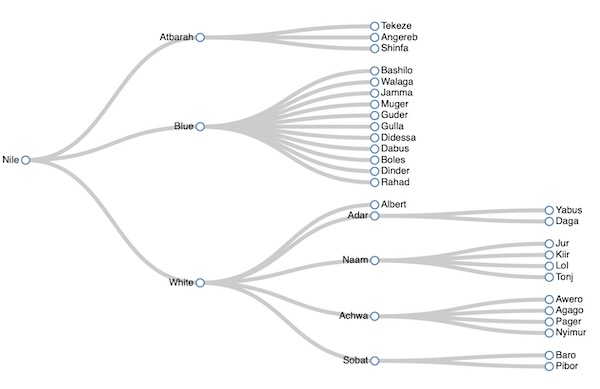

## Gem D3 : Tidy Tree - Nile Rivers

Use the Nile and it's tributaries as input data to generate a tidy tree visualization.



Small edits to the styling in the HTML.

Also one adjustment to the JavaScript to better fit the rightmost text labels.

```js
const tree = d3.tree().size([height-50, width-50]);
```

The prompt :

```
Write a Javascript function to generate a d3.js tidy tree visualization for the input data file nile_rivers.csv.
The function should take input parameters of input data file name, plot width and plot height.
Generate the JavaScript code and save to file. tidy_tree.js.
Also generate an index.html file to call this javascript function.
Do not start any processes to install or invoke an http server.
```

---

* d3 gallery : [tidy tree](https://observablehq.com/@d3/tree/2)
* on github : [with flare.csv or input data](https://gist.github.com/mbostock/4339184/4a714a9dc36ab6382ed8919a50b1fad65e861d48#file-flare-csv) - reminder that finding and understanding the specific input data format is part of making the visualization
* wikipedia : [Atbarah River](https://en.wikipedia.org/wiki/Atbarah_River)
  * Average monthly flow (1912–1982) of the Atbarah measured approximately 25 km upstream of its mouth, measured in m3/s:[7]
  * chart data at the bottom
* [D3 Gallery](https://observablehq.com/@d3/gallery) : of different visualizations
