## Gem D3: A Gemini CLI generated library of D3.js visualizations

We used Gemini CLI with input datasets and prompts to generate the JavaScript and example HTML for a collection of d3.js visualizations. 

For the initial examples, 10 datasets yielded 1,500 lines of code.

The backstory for this repo is discussed in [this blog post](https://nmoroney.github.io/data/2026/260326_datasets_to_code/index.html).

---

| Examples | | | |
| --- | --- | --- | --- |
|  [Line Plot](gd3_01_line_plot-date_counts/) | 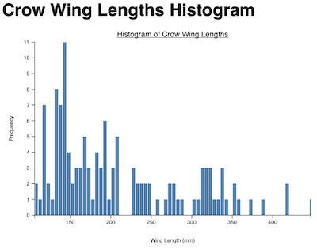 [Histogram](gd3_02_histogram/) |  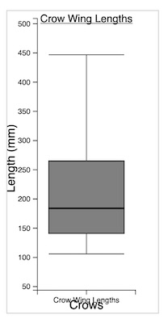 [Box Plot](gd3_03_boxplot/)|  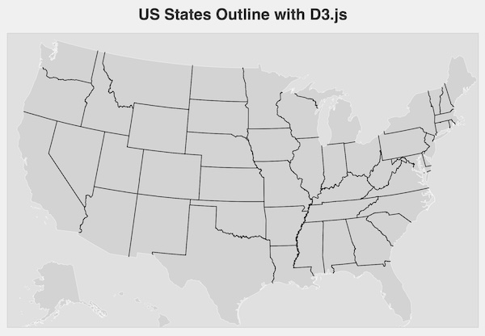 [Map](gd3_04_us_states_plot/)|
|  [Density](gd3_05_density_plot/) |  [Scatter Plot](gd3_06_scatter_xy/) | 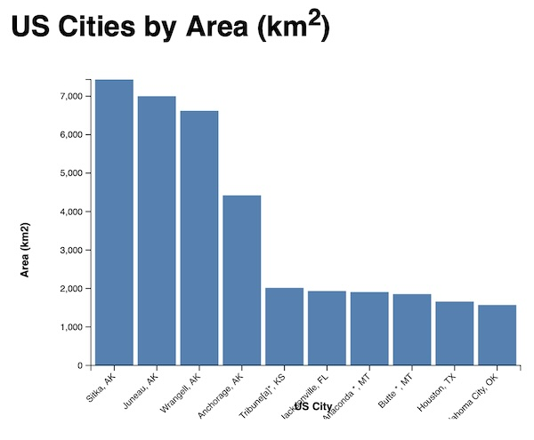 [Vertical Bar Plot](gd3_07_vertical_bar_chart/) | 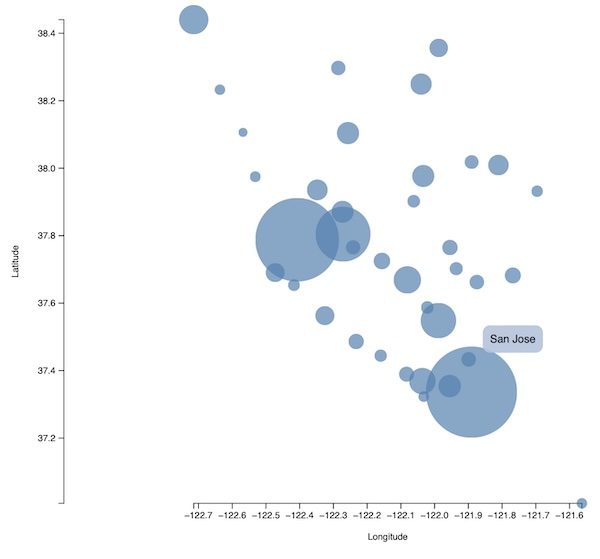 [Bubble Chart](gd3_08_bubble_chart/) |
|  [Horizontal Bar Plot](gd3_09_horizontal_bar_chart/) |  [Tidy tree](gd3_10_tidy_tree/) | 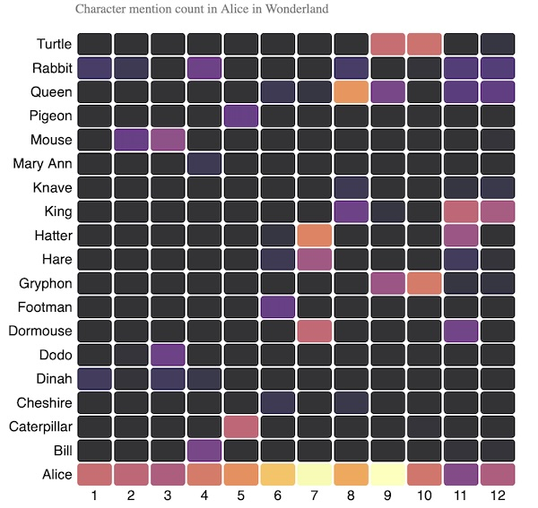 [Heat map](gd3_11_heat_map/) |  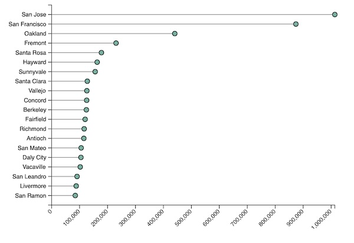 [Ordered Horizontal Lollipop](gd3_12_ordered_horizontal_lollipop/)|
| 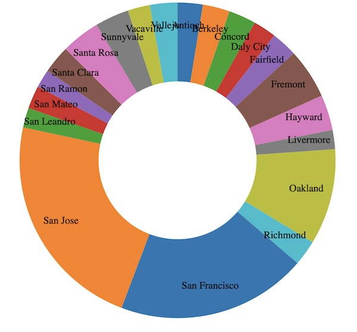 [Donut Plot](gd3_13_donut/) |  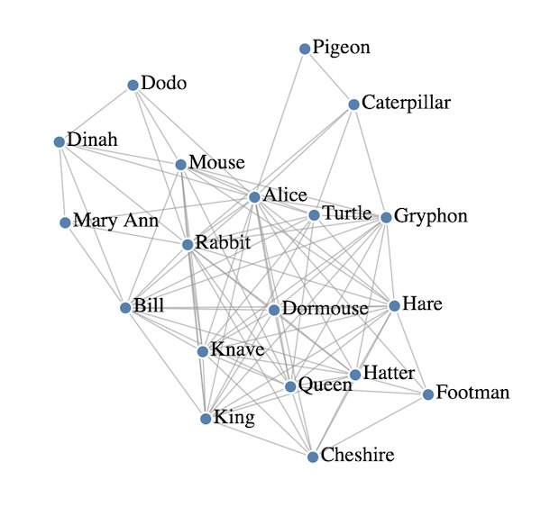 [Network Graph](gd3_14_force_based_graph/)|  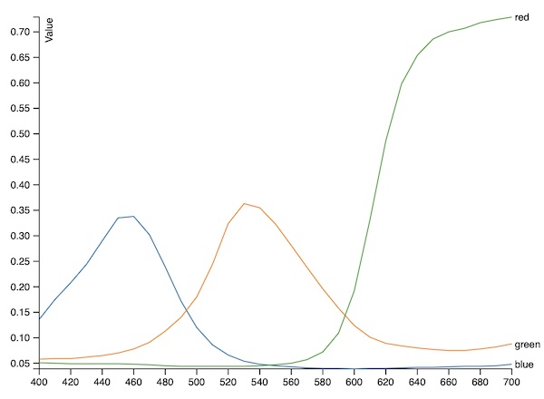 [Multi Line](gd3_15_multi_line/)| 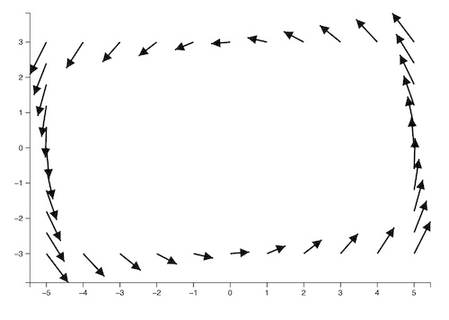 [Arrow Plot](gd3_16_connected_pairs/) |

